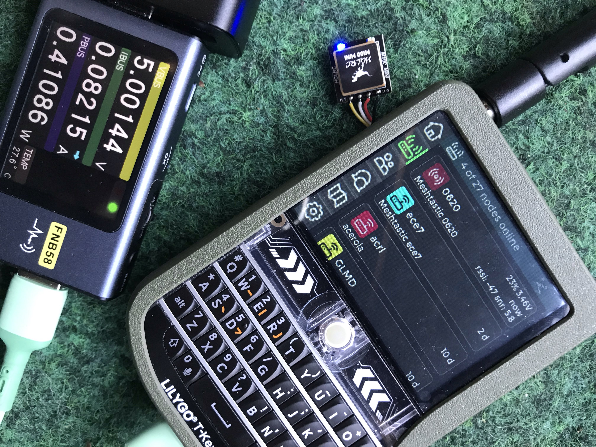
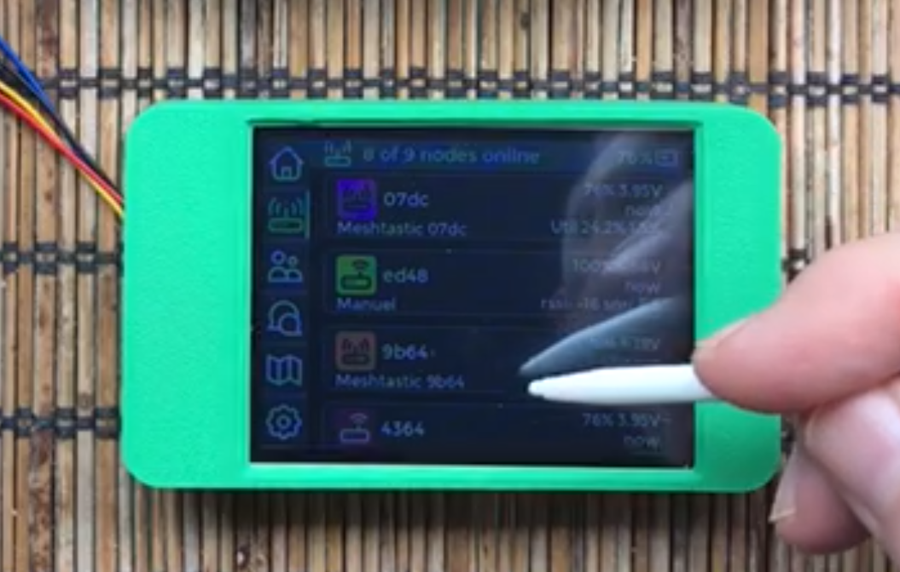
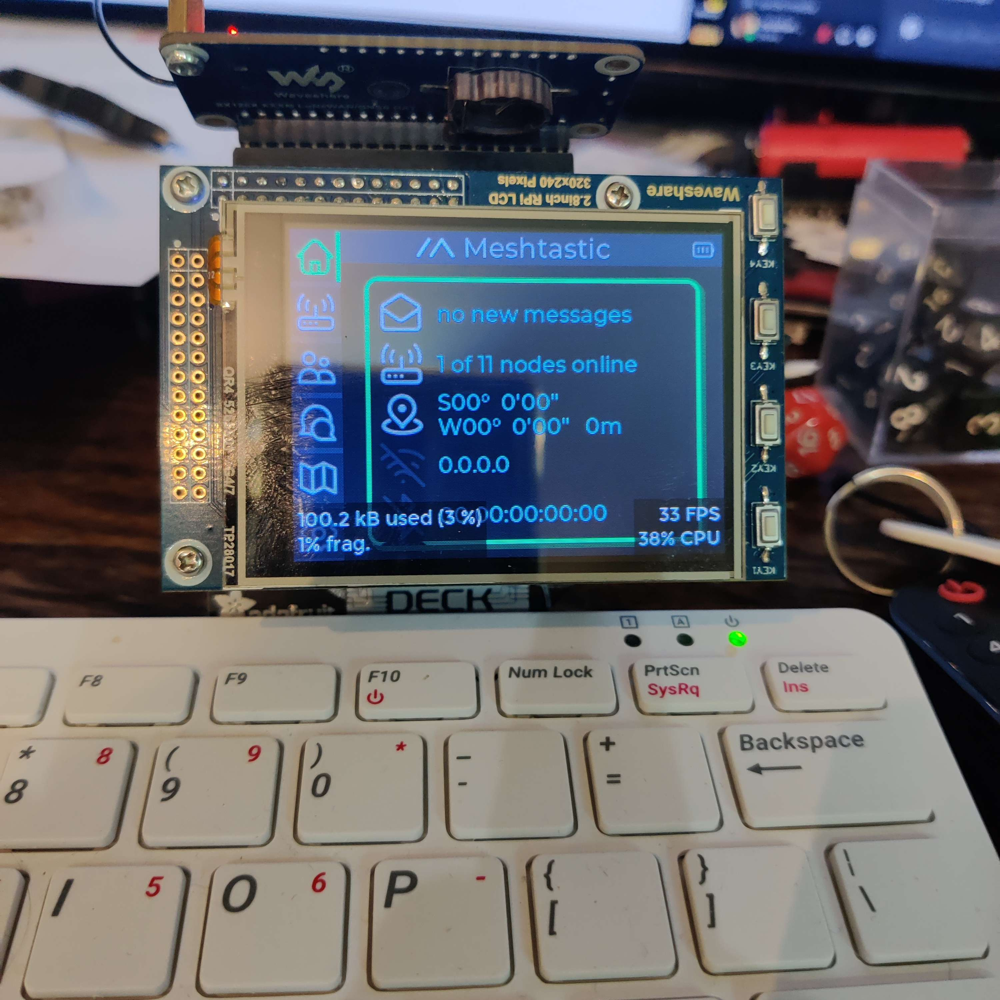
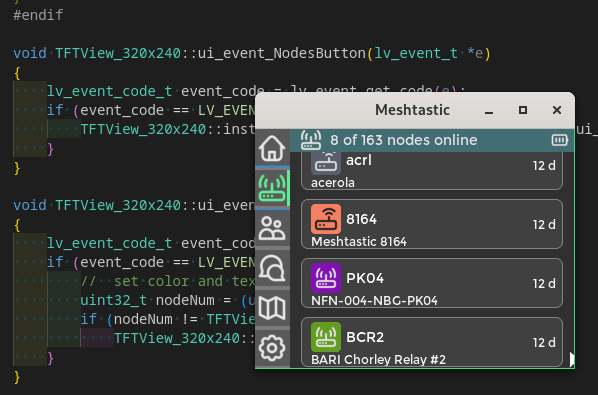
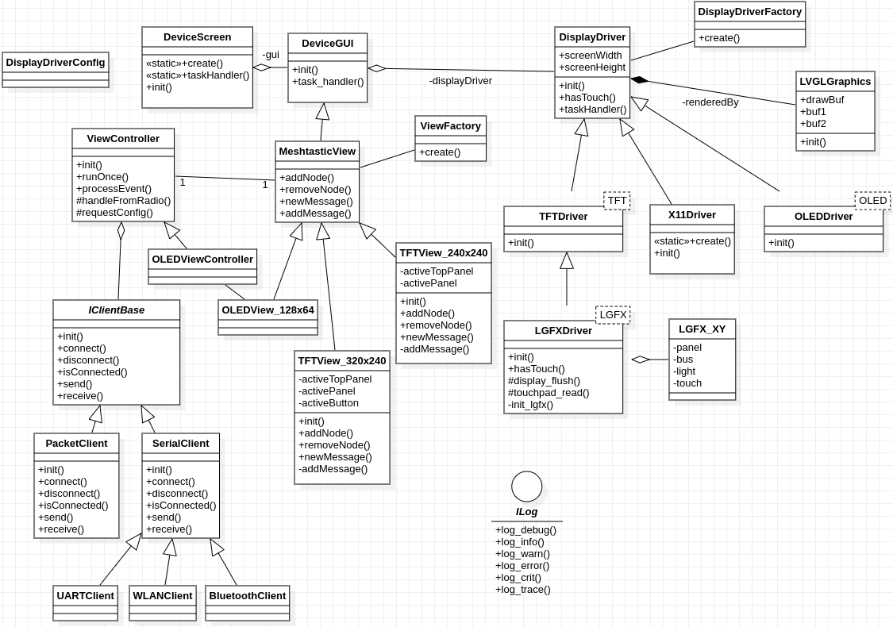

#

  <h1 align="center"> Meshtastic device-ui library</h1>
  
A versatile UI library for the <a href="https://meshtastic.org">meshtastic® project</a> 

<!--Project specific badges here-->

    
  

## :wave: Introduction

### Meshtastic device-ui library for TFT and OLED screens

This C++ library is intended to support the following scenarios with enhanced screen UI:

- Integrated with meshtastic firmware for LoRa devices with TFT display (or potentially also OLED +PSRAM)
- Stand-alone TFT+MCU devices such as WT32-SC01, CYD or T-HMI connected with meshtastic LoRa devices
- Linux based devices with LoRa shield, e.g Raspberry Pi / Milk-V Duo/Mars with TFT display (hat or diy)
- Native Linux X11 application with SimRadio e.g. for tests, GUI simulation & debugging (MQTT only application)

Vectors and icons by <a href="https://www.svgrepo.com/" target="_blank">SVG Repo</a>

## :pencil: TODOs

### General Architecture

    - [ ] Overall design (MVC approach)
      - [x] DisplayDriver inheritance hierarchy
      - [x] DisplayDriver factory
      - [x] TFT Driver
      - [ ] OLED Driver
      - [ ] E-Ink Driver
      - [x] View hierarchy
      - [x] View factory
      - [x] Controller design and interface implementation
      - [x] Controller <-> model interface
        - [x] Packet based thread safe interface
        - [x] serial communication interface
        - [x] protobuf encoding/decoding
      - [x] Logging interface
      - [x] Add lvgl compatible input driver interface
      - [ ] Add interface for persistency
        - [ ] Screen calibration data
        - [x] Device settings (General)
        - [ ] Message storage
        - [ ] Serial connection config
    - [x] Dynamic behavior
      - [x] Startup config
      - [x] Restart behavior
      - [x] Display sleep
      - [x] Heartbeat timer based on device input actions
    - [x] Localisation support
      - [x] German translation
      - [x] Spanish translation
      - [x] Portuguese translation
      - [x] Swedish translation
      - [x] Finnish translation
      - [x] Polish translation
      - [x] Portuguese translation
      - [x] Netherlands translation
      - [x] Dutch translation
      - [ ] French translation
      - [ ] Italian translation
      - [ ] Turkish translation
      - [ ] Optional: other languages with latin or cyrillic characters)
    - [ ] Support dynamic OLED / Color(TFT) selection
    - [x] Add support for UI scaling and try eliminate fixed positioning (lvgl v9)
    - [ ] Allow co-existence of generated files/views by different eez-studio projects
    - [ ] Fix PSRAM draw buffer issue and do buffer size optimization
    - [ ] Test native lvgl driver support
      - [ ] TFT drivers
      - [ ] OLED drivers
    - [ ] Check lvgl native driver DMA double-buffering
    - [ ] E-Ink support
    - [ ] RP2040 support

### Meshtastic UI (general)

    - [x] Boot Screen
    - [x] Home Screen
      - [x] Messages info
      - [x] Nodes info
      - [x] GPS info
      - [x] WiFi info
      - [x] Time and Data
      - [x] MQTT info
      - [x] Free memory info
    - [ ] Nodes panel
      - [x] Scroll display and sorting
      - [x] Node details
      - [x] Position data
      - [x] Telemetry data display
      - [ ] Repeater support (manual insertion)
      - [ ] LastHeard & time source handling improvements
      - [ ] Remote Node configuration
      - [x] Filter (offline, unknown, public key, position, hops away, by name)
      - [x] Highlight (position, telemetry, , by name)
    - [x] Group channel panel
    - [x] Chat panel
      - [x] Scroll container and messages display
      - [x] Virtual keyboard
      - [x] Message acknowledgement
      - [x] Delete chat
    - [ ] Map
      - [ ] Tiles dynamic loading
        - [ ] SD card
        - [ ] WLAN
      - [ ] Pan & Zoom
      - [ ] Node locations
      - [ ] Location precision
    - [ ] Settings
      - [ ] Basic Settings
        - [x] User name
        - [x] Region
        - [x] Modem Preset
        - [x] Channel
        - [x] Device Role
        - [x] Screen Timeout
        - [x] Screen Calibration
        - [x] Brightness
        - [x] Input Control
        - [x] Message Alert / Ringtones
        - [x] Language
        - [ ] Timezone
        - [ ] Maps
        - [ ] Audio
        - [x] NodeDB / Factory Reset
        - [x] Reboot / Shutdown
      - [ ] Advanced Settings
        - [ ] General Settings
        - [ ] Radio Settings
        - [ ] Module Settings
    - [x] Status bar with battery symbol
    - [x] UI Keyboard navigation & control
    - [x] Latin supplemental fonts
    - [ ] Cyrillic font glyphs

### :pager: T-Deck (also covered: unPhone)

    - [x] Firmware project integration
    - [ ] T-Deck UI
      - [x] 320x240 scalable view
      - [x] GPS position
      - [ ] Radio frequency display
      - [ ] Offline map display
    - [x] I2C keyboard input handling
    - [x] Trackball support (e.g. fast scrolling list views)
    - [ ] SD card support, mainly for offline maps or import/export (config & chat history)
    - [ ] load custom fonts from SD card
    - [ ] (Optional): allow bluetooth connection (-> PhoneAPI queue re-design)
    - [ ] I2S Audio support

### :watch: T-Watch

    - [ ] T-Watch UI
      - [ ] 240x240 View
      - [ ] Clock screen
    - [ ] Firmware project integration
    - [ ] Continue work on eez-studio UI screens
    - [ ] Refactoring of common code with 320x240 view into base class

### OLED

    - [ ] Provide demo for OLED 128x64 screen
    - [ ] Space and RAM requirements analysis

### :penguin: Portduino (Raspberry / native linux)

    - [x] Project integration into firmware
    - [x] Display driver run-time configuration interface
    - [x] Add missing settingsMap entries for DisplayDriverConfig
    - [x] Integrate lvgl keyboard input driver
    - [x] Add support for several SPI devices
    - [ ] Add pwm brightness control
    - [ ] IP address display (eth/wlan)
    - [x] Target environment cleanup

### :iphone: Stand-alone Device

    - [x] Dedicated device-ui project
    - [ ] Sunton/EstarDyn CYD support (320x240) Note: no longer working due to insufficient memory 
    - [x] LilyGo T-HMI support (320x240)
    - [X] WT32-SC01 (Plus) support (480x320)
      - [x] Display driver
      - [X] 480x320 view -> scaled 320x240
    - [ ] image size reduction
    - [ ] Fix/Workaround serial light sleep UART reading issue (-> firmware)
    - [ ] Heartbeat timer improvements
    - [x] Serial data send/receive
      - [x] UART connection support
      - [ ] WLAN connection support
      - [ ] Bluetooth connection support
    - [ ] Serial Interface configuration UI screen
    - [ ] Allow serial connection initialisation at runtime

## Architecture Overview device-ui library (Class Diagram)

## Stats

