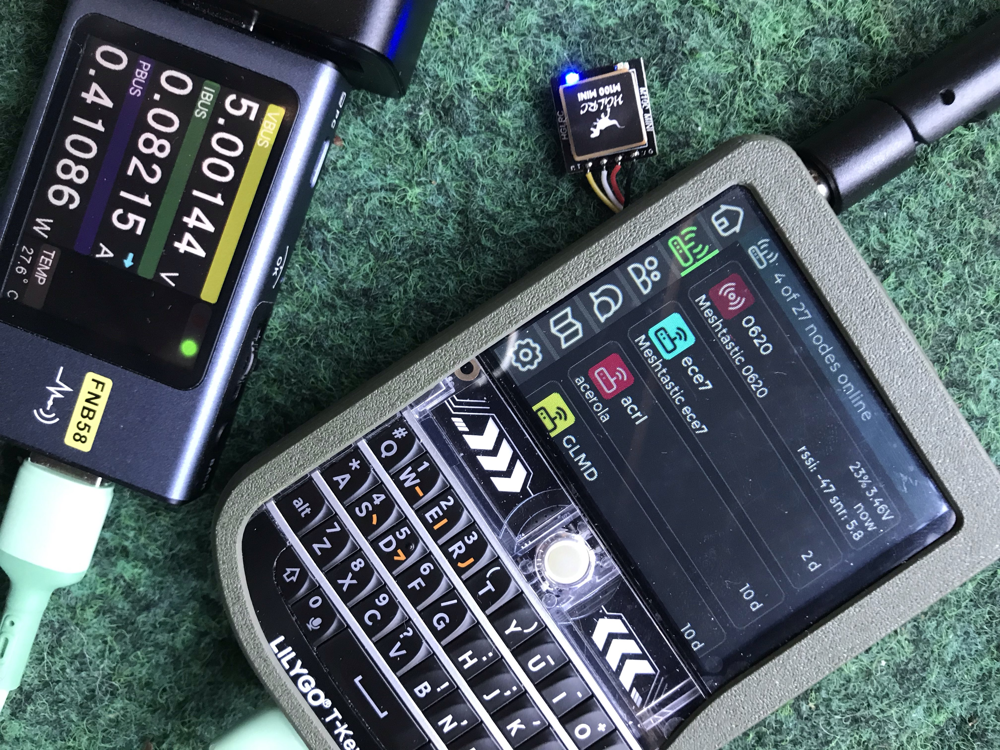
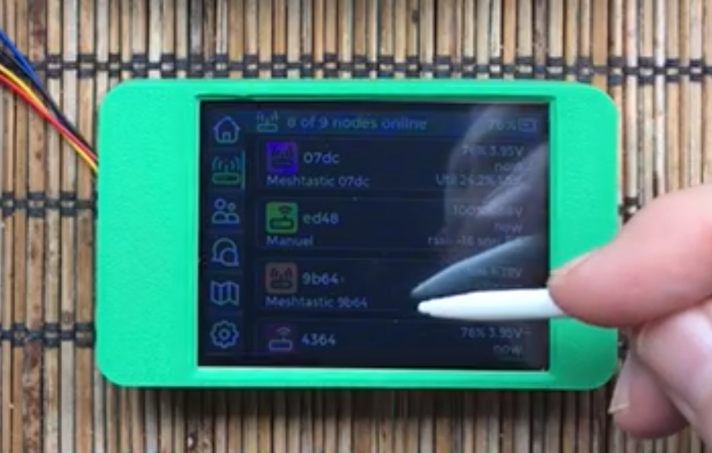
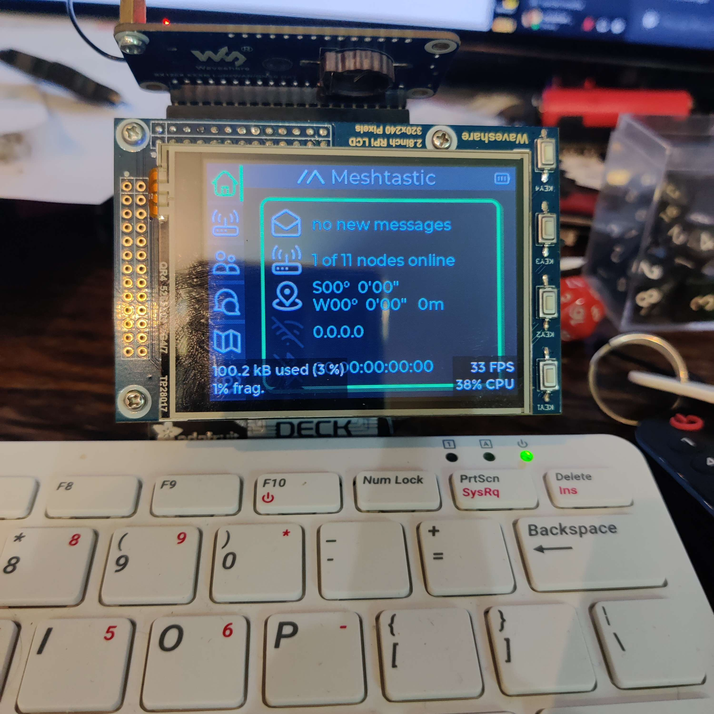
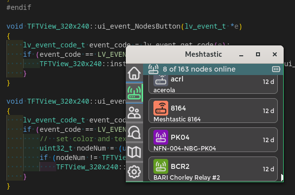

#

  <h1 align="center"> Meshtastic device-ui library</h1>
  
A versatile UI library for the <a href="https://meshtastic.org">meshtastic® project</a> 

<!--Project specific badges here-->

    
  

## :wave: Introduction

### Meshtastic device-ui library for TFT and OLED screens

This C++ library is intended to support the following scenarios with enhanced screen UI:

- Integrated with meshtastic firmware for LoRa devices with TFT display (or potentially also OLED +PSRAM)
- Stand-alone TFT+MCU devices such as WT32-SC01, CYD or T-HMI connected with meshtastic LoRa devices
- Linux based devices with LoRa shield, e.g Raspberry Pi, Meshstick, Milk-V Duo/Mars with TFT display (hat or diy)
- Native Linux X11 application with SimRadio e.g. for tests, GUI simulation & debugging (MQTT only application)

Vectors and icons by <a href="https://www.svgrepo.com/" target="_blank">SVG Repo</a> 
Graphics using <a href="https://lvgl.io/" target="_blank">LVGL</a> library

## :hammer_and_wrench: Getting Started

This library is built using [LVGL](https://lvgl.io/) and is designed to be cross-platform. To get started:
1. Ensure you have the `lvgl` and `meshtastic-protobufs` dependencies available in your build environment.
2. For embedded targets, configure your display driver in the `DisplayDriver` factory.
3. For Linux/X11 testing, use the provided CMake configuration to build the simulator.

## :pencil: TODOs

### General Architecture

    - [ ] Overall design (MVC approach)
      - [x] DisplayDriver inheritance hierarchy
      - [x] DisplayDriver factory
      - [x] TFT Driver
      - [ ] OLED Driver
      - [ ] E-Ink Driver
      - [x] View hierarchy
      - [x] View factory
      - [x] Controller design and interface implementation
      - [x] Controller <-> model interface
        - [x] Packet based thread safe interface
        - [x] serial communication interface
        - [x] protobuf encoding/decoding
      - [x] Logging interface
      - [x] Add lvgl compatible input driver interface
      - [x] Add interface for persistency
        - [x] Screen calibration data
        - [x] Device settings (General)
        - [x] Message storage
        - [ ] Serial connection config
    - [x] Dynamic behavior
      - [x] Startup config
      - [x] Restart behavior
      - [x] Display sleep
      - [x] Heartbeat timer based on device input actions
    - [x] Localisation support
      - [x] Danish