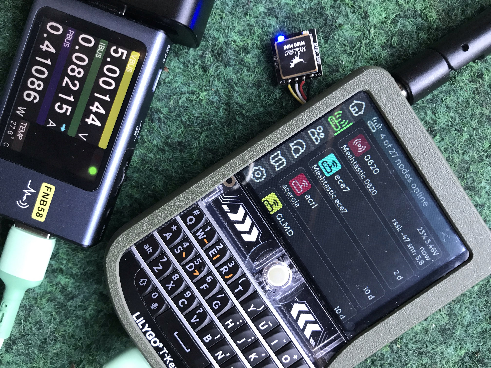
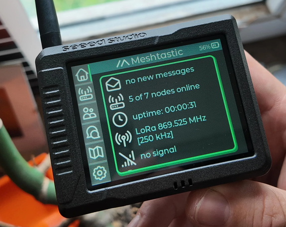
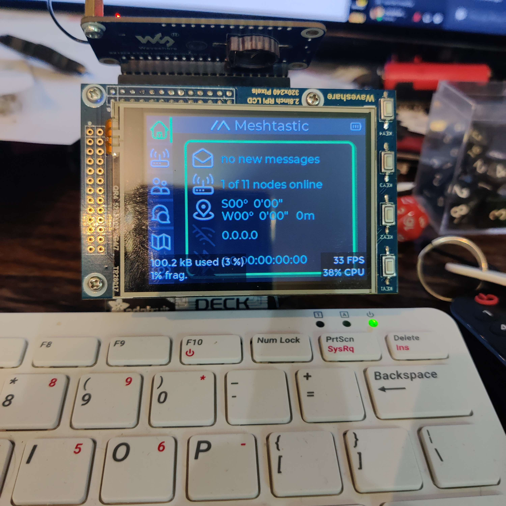
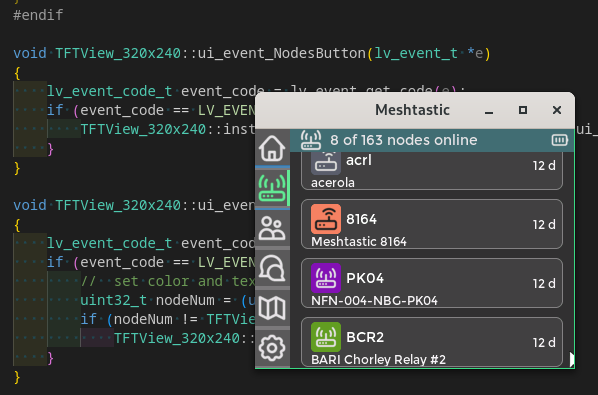
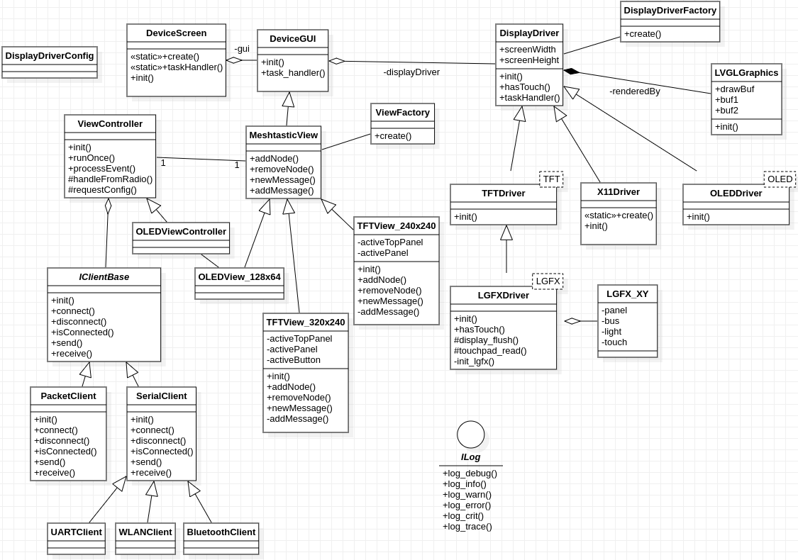

#

  <h1 align="center"> Meshtastic device-ui library</h1>
  
A versatile UI library for the <a href="https://meshtastic.org">meshtastic® project</a> 

<!--Project specific badges here-->

    
  

## :wave: Introduction

### Meshtastic device-ui library for TFT and OLED screens

This C++ library is intended to support the following scenarios with enhanced screen UI:

- Integrated with meshtastic firmware for LoRa devices with TFT display (or potentially also OLED +PSRAM)
- Stand-alone TFT+MCU devices such as WT32-SC01, CYD or T-HMI connected with meshtastic LoRa devices
- Linux based devices with LoRa shield, e.g Raspberry Pi, Meshstick, Milk-V Duo/Mars with TFT display (hat or diy)
- Native Linux X11 application with SimRadio e.g. for tests, GUI simulation & debugging (MQTT only application)

Vectors and icons by <a href="https://www.svgrepo.com/" target="_blank">SVG Repo</a> 
Graphics using <a href="https://lvgl.io/" target="_blank">LVGL</a> library

## :iphone: Supported Devices

### Firmware-integrated TFT devices

- [x] LILYGO T-Deck / T-Deck Plus
- [ ] LILYGO T-Lora Pager
- [ ] LILYGO T-Watch S3
- [ ] LILYGO T-Watch Ultra
- [ ] LILYGO T-Display Pro S3
- [x] Seeed SenseCAP Indicator
- [x] Seeed Wio Tracker L2
- [ ] Seeed Mesh Tracker X2
- [x] Heltec V4 / V4 R8 TFT
- [x] Elecrow ThinkNode M9
- [ ] Elecrow ThinkNode MX
- [x] Elecrow CrowPanel Advance S3 (2.4"/2.8"/3.5")
- [ ] Elecrow CrowPanel Advance P4 (5.0"/7.0"/9.0"/10.1")
- [ ] RAK WisMesh TAB V2
- [x] unPhone
- [x] PICOmputer S3

### Stand-alone (via standalone-ui project)

- [x] LilyGo T-HMI (320x240)
- [x] Replicator 4848S040 (esp32 + nrf52 radio)
- [x] Makerfabs (480x480)
- [x] WT32-SC01 (Plus) (480x320)
- [x] NM CYD C5 (320x240, 8MB PSRAM)
- [x] JC4827W543C
- [ ] Sunton/EstarDyn CYD (original - no longer working due to insufficient memory)

### DIY / generic LGFX boards

- [x] Generic ESP32 + ILI9341/ST7789/ILI9488 + XPT2046/FT6236 (see Mesh-Tab below)
- [x] NodeMCU-32S + ILI9341/XPT2046
- [x] Makerfabs 480x480
- [x] ESP32 4848S040

## :pencil: TODOs

### General Architecture

- [ ] Overall design (MVC approach)
  - [x] DisplayDriver inheritance hierarchy
  - [x] DisplayDriver factory
  - [x] TFT Driver
  - [ ] OLED Driver
  - [ ] E-Ink Driver
  - [x] View hierarchy
  - [x] View factory
  - [x] Controller design and interface implementation
  - [x] Controller <-> model interface
    - [x] Packet based thread safe interface
    - [x] serial communication interface
    - [x] protobuf encoding/decoding
  - [x] Logging interface
  - [x] Add lvgl compatible input driver interface
  - [x] Add interface for persistency
    - [x] Screen calibration data
    - [x] Device settings (General)
    - [x] Message storage
    - [ ] Serial connection config
- [x] Dynamic behavior
  - [x] Startup config
  - [x] Restart behavior
  - [x] Display sleep
  - [x] Heartbeat timer based on device input actions
- [x] Localisation support
  - [x] Bulgarian translation
  - [x] Czech translation
  - [x] Danish translation
  - [x] Dutch translation
  - [x] Finnish translation
  - [x] French translation
  - [x] German translation
  - [x] Greek translation
  - [x] Hungary translation
  - [x] Italian translation
  - [x] Netherlands translation
  - [x] Norwegian translation
  - [x] Polish translation
  - [x] Portuguese translation
  - [x] Russian translation
  - [x] Slovenian translation
  - [x] Spanish translation
  - [x] Swedish translation
  - [x] Turkish translation
  - [x] Ukrainian translation
- [x] Support dynamic OLED / Color(TFT) selection
- [x] Add support for UI scaling and try eliminate fixed positioning (lvgl v9)
- [x] Allow co-existence of generated files/views by different eez-studio projects
- [x] Douple display buffer DMA (P4 only)
- [ ] E-Ink support
- [ ] RP2350 support

### Meshtastic UI (general)

- [x] Boot screen
- [x] Customizable boot screen
- [x] Home Screen
  - [x] Messages info
  - [x] Nodes info
  - [x] Time and Date
  - [x] LoRa info
  - [x] GPS info
  - [x] WiFi info
  - [x] MQTT info
  - [x] SD card info
  - [x] Free memory info
  - [x] Node fingerprint info
- [ ] Nodes panel
  - [x] Scroll display and sorting
  - [x] Node details
  - [x] Position data
  - [x] Telemetry data display
  - [ ] Repeater support (manual insertion)
  - [x] LastHeard & time source handling improvements
  - [ ] Remote Node configuration
  - [x] Filter (offline, unknown, channel, public key, position, hops away, by name)
  - [x] Highlight (position, telemetry, IAQ, by name)
- [x] Group channel panel
- [x] Chat panel
  - [x] Scroll container and messages display
  - [x] Virtual keyboard
  - [x] Message acknowledgement
  - [x] Delete chat
- [x] Map
  - [x] Tiles dynamic loading
    - [x] SD card
    - [x] WLAN
  - [x] Pan & Zoom
  - [x] Node locations
  - [x] PMTiles support
  - [ ] Location precision
  - [ ] Geofence
- [ ] Settings
  - [ ] Basic Settings
    - [x] User name
    - [x] Region
    - [x] Modem Preset
    - [x] Channel
    - [x] Device Role
    - [x] Screen Timeout
    - [x] Screen Calibration
    - [x] Screen Lock
    - [x] Brightness
    - [x] Input Control
    - [x] Message Alert / Ringtones
    - [x] Language
    - [ ] Timezone
    - [x] Maps
    - [ ] Audio
    - [x] NodeDB / Factory Reset / Chat History
    - [x] Reboot / BT Programming / Shutdown
  - [ ] Advanced Settings
    - [ ] General Settings
    - [ ] Radio Settings
    - [ ] Module Settings
- [x] Status bar with battery symbol
- [x] UI Keyboard navigation & control
- [x] Latin supplemental fonts
- [x] Cyrillic font glyphs

### OLED

- [ ] Provide demo for OLED 128x64 screen
- [ ] Space and RAM requirements analysis

### :penguin: Portduino (Raspberry / native linux)

- [x] Project integration into firmware
- [x] Display driver run-time configuration interface
- [x] Add missing settingsMap entries for DisplayDriverConfig
- [x] Integrate lvgl keyboard input driver
- [x] Add support for several SPI devices
- [ ] Add pwm brightness control
- [ ] IP address display (eth/wlan)
- [x] Target environment cleanup
- [ ] SDL support

### :iphone: Stand-alone Device

- [x] Dedicated standalone-ui project
- [ ] Sunton/EstarDyn CYD support (320x240) Note: no longer working due to insufficient memory
- [x] NM CYD C5 (320x240) with 8MB PSRAM
- [x] LilyGo T-HMI support (320x240)
- [x] Replicator support (esp32 + nrf52 radio)
  - [x] Display driver
  - [x] 480x480 view -> scaled 320x240
- [x] WT32-SC01 (Plus) support (480x320)
  - [x] Display driver
  - [x] 480x320 view -> scaled 320x240
- [x] image size reduction
- [ ] Fix/Workaround serial light sleep UART reading issue (-> firmware)
- [ ] Heartbeat timer improvements
- [x] Serial data send/receive
  - [x] UART connection support
  - [x] TCP/IP connection support
  - [ ] WLAN connection support
  - [ ] Bluetooth connection support
- [ ] Serial Interface configuration UI screen
- [ ] Allow serial connection initialisation at runtime

## Architecture Overview device-ui library (Class Diagram)

## Stats

