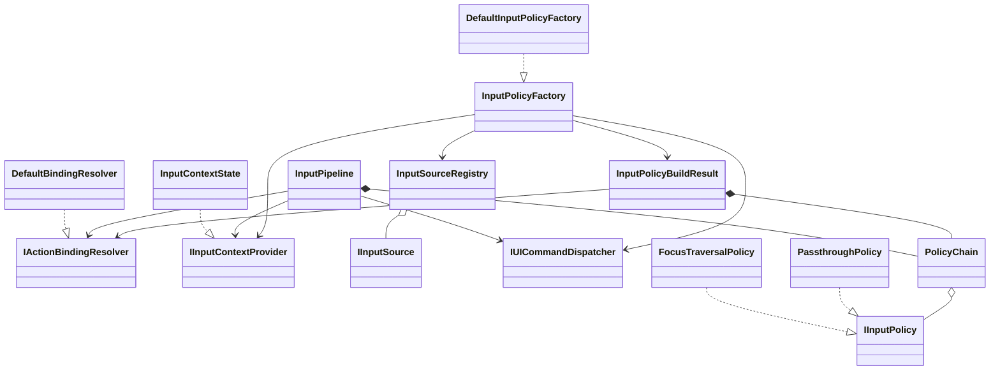
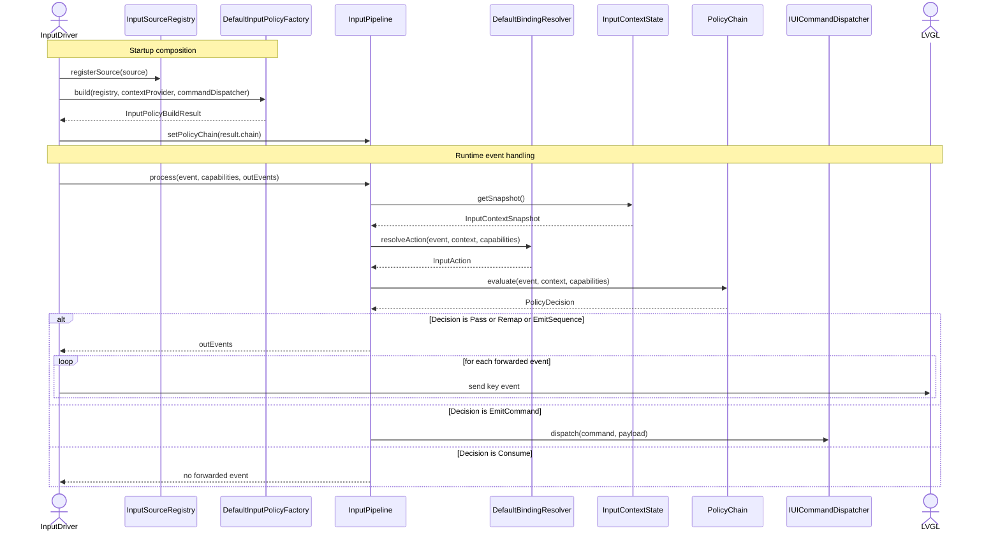

# Input Policy Strategy Design

## Purpose

Define a flexible, capability-driven input architecture for LVGL navigation and app commands across different keyboard devices.

Goals:

1. Keep input drivers hardware-focused.
2. Support different key layouts and optional keyboards without hard-coded behavior.
3. Support widget-semantic behavior (for example `TextEdit` vs `Map`).
4. Support dedicated hardware keys (`Home`, `Chat`, `Location`) and long-press variants.
5. Keep UI-specific actions in app/view/controller layers, not in low-level drivers.

## Key Constraints

1. In this LVGL version, `LV_KEY_NEXT` and `LV_KEY_PREV` are handled in indev keypad logic before normal widget key handlers.
2. Therefore, global policy decisions must happen before events are handed to default LVGL widget processing.

## High-Level Architecture

Pipeline:

1. Input sources emit raw key events.
2. Binding resolver maps raw key events to abstract intents.
3. Policy chain evaluates event + UI context + source capabilities.
4. Decision yields one of:
   - pass through LVGL key event
   - remap key/intent
   - consume event
   - emit UI command(s)
   - emit output event sequence
5. App command dispatcher executes UI commands.

## Proposed Source Tree Placement

### New input policy module

- `include/input/policy/`
- `source/input/policy/`

### Existing source adapters (no relocation)

- `source/input/KeyMatrixInputDriver.cpp`
- `source/input/I2CKeyboardInputDriver.cpp`

### UI context producer

- `source/graphics/TFT/TFTView_320x240.cpp`
- `include/graphics/view/TFT/TFTView_320x240.h`

UI files provide context snapshots only. They do not contain low-level key remap logic.

## Core Data Model

### InputEvent

Fields:

1. `sourceId`
2. `rawKeyCode`
3. `pressed`
4. `pressKind` (`Press`, `Release`, `LongPress`, `LongPressRepeat`)
5. `modifiers`
6. `timestampMs`

### InputCapabilities

Fields:

1. `hasArrowKeys`
2. `hasCancelKey`
3. `hasEnterKey`
4. `hasModifiers`
5. `supportsLongPress`
6. `supportsRepeat`
7. `supportsTextEntry`

### InputContextSnapshot

Fields:

1. `focusSemantic` (`Unknown`, `TextEdit`, `Button`, `List`, `Map`, ...)
2. `isEditMode`
3. `activePanelId`
4. `canLeaveEditMode`
5. `focusedClassHint` (optional)

### InputAction (abstract intent)

Examples:

1. `NavigateUp`, `NavigateDown`, `NavigateLeft`, `NavigateRight`
2. `Activate`
3. `LeaveEditMode`
4. `Back`, `Cancel`
5. `CommandHome`, `CommandOpenChats`, `CommandOpenMap`, `CommandToggleGps`

### StrategyDecision

Fields:

1. `decisionType` (`Pass`, `Remap`, `Consume`, `EmitCommand`, `EmitSequence`)
2. optional remapped event/intent
3. optional command payload
4. optional event sequence payload

## Core Interfaces

### `IInputContextProvider`

Returns current `InputContextSnapshot`.

### `IInputPolicy`

Evaluates `InputEvent + InputCapabilities + InputContextSnapshot` and returns `StrategyDecision`.

### `IActionBindingResolver`

Maps raw key event to initial abstract `InputAction` based on source profile and capabilities.

### `IInputSource`

Provides source id, capabilities, and event polling/dispatch.

### `IUICommandDispatcher`

Executes app-level commands emitted by policy layer.

Important boundary:

- Policies emit commands.
- Dispatcher executes commands.
- Input drivers do not call `ViewController` directly.

## UML Class Diagram

The following Mermaid class diagram is kept intentionally simple so GitHub renders it reliably.
It shows inheritance, ownership, aggregation, and the main assembly/runtime relationships in the current policy layer.

## Typical Input Flow

The following sequence diagram shows a typical runtime path from a hardware-backed input driver through the policy layer and into LVGL.
It also shows the alternate path where the policy layer consumes an event or emits a UI command instead of forwarding a key to LVGL.

## Policy Order (Precedence)

Recommended order from highest to lowest:

1. `SafetyPolicy`
2. `GlobalSpecialKeyPolicy`
3. `EditModePolicy`
4. `ContextNavigationPolicy`
5. `CapabilityFallbackPolicy`
6. `DefaultPassPolicy`

Conflict rule: first non-pass decision wins.

## Special Key Support

Dedicated device keys are modeled as commands, not plain LVGL nav keys.

Examples:

1. `Home` key -> `GoHome`
2. `Chat` key -> `OpenChats`
3. `Map` key -> `OpenMap`
4. `Location` key short press -> `SendPing`
5. `Location` key long press -> `ToggleGps`

This supports device-specific behavior while keeping the driver generic.

## TextEdit Behavior Rule

When focus semantic is `TextEdit`:

1. Arrow intents remain cursor movement.
2. Generic focus traversal remaps are disabled.
3. Leaving edit mode uses abstract `LeaveEditMode` action.

`LeaveEditMode` binding is capability-based:

1. If cancel exists: cancel -> `LeaveEditMode`.
2. If cancel does not exist: fallback mapping (for example long-enter or configured chord).

## Dynamic Device Composition

No hard-coded factory by board.

At startup:

1. Register all detected input sources (matrix, optional I2C keyboard, etc.).
2. Collect merged capabilities.
3. Build policy chain and bindings from detected sources + config profile.
4. If input topology changes at startup scan stage, rebuild composition.

## Adding a New Keyboard Source (for example I2C)

Short answer:

1. Creating only a key mapping in a new driver is enough for basic key forwarding.
2. It is not enough for full policy-aware behavior and capability-driven fallbacks.

### Minimum path (basic bring-up)

Touch these parts:

1. `source/input/I2CKeyboardInputDriver.cpp`:
   - scan hardware
   - map hardware keys to LVGL key codes
   - emit `InputEvent` values into `InputPipeline`
2. `InputCapabilities` declaration for that source:
   - set real capability flags (`hasCancelKey`, `hasModifiers`, `supportsLongPress`, and so on)
3. Driver init path:
   - create pipeline (or reuse shared one, depending on current wiring)

With only this, keys can work, but advanced behavior may be incomplete or wrong when capability assumptions differ from matrix keyboard defaults.

### Full integration path (recommended)

Touch these parts:

1. `source/input/I2CKeyboardInputDriver.cpp`:
   - implement/maintain hardware scan + key mapping
   - emit `InputEvent` with correct `sourceId`, `pressKind`, and timestamps
2. `include/input/policy/IInputSource.h` implementation for the new source:
   - provide `getSourceId()`
   - provide accurate `getCapabilities()`
   - provide `poll()` behavior if source-driven polling is used
3. `source/input/policy/InputSourceRegistry.cpp` usage at startup:
   - register the new source in registry
   - ensure merged capabilities include this source
4. `source/input/policy/DefaultInputPolicyFactory.cpp`:
   - verify policy composition rules still hold with new capabilities
   - add conditional policies if this source introduces new keys/features
5. `source/input/policy/DefaultBindingResolver.cpp`:
   - add raw key -> `InputAction` mappings for any source-specific key codes
6. `source/input/policy/*Policy*.cpp`:
   - only if new keys imply new behavior (for example dedicated Map/Home/Location keys)
7. `source/graphics/TFT/TFTView_320x240.cpp` context bridge:
   - only if new behavior needs additional context fields to decide policy

### Rule of thumb

1. New hardware key code only: update driver mapping + binding resolver.
2. New hardware capability (cancel/modifier/long-press): update capabilities + registry/factory usage.
3. New semantic behavior (special commands or context rules): add/extend policy classes.

### Review checklist for new keyboard integration

1. Does the source report truthful `InputCapabilities`?
2. Are raw key codes mapped to `InputAction` in `DefaultBindingResolver`?
3. Is the source registered in `InputSourceRegistry` during startup?
4. Does factory-built policy chain still match capability expectations?
5. In logs, do you see full flow: source -> resolver -> policy -> pipeline decision?
6. Do TextEdit and Map contexts still behave correctly for arrows and cancel/leave-edit?

## Configuration Model

Per-source profile should define:

1. capability flags
2. key-to-intent bindings
3. long-press and repeat bindings
4. fallback bindings (for missing capabilities)
5. enabled policy list and optional order overrides

## Suggested Phase Plan

1. Add scaffolding interfaces and passthrough policy.
2. Route matrix source through pipeline with no behavior changes.
3. Add context provider bridge.
4. Add edit/map/navigation policies.
5. Add special key command policy and dispatcher.
6. Add capability fallback rules.
7. Add I2C source integration and dynamic composition.
8. Add tests and remove temporary diagnostics.

## Acceptance Criteria

1. `TextEdit` arrow behavior does not trigger focus traversal.
2. Leave-edit works on devices with and without cancel keys.
3. Dedicated keys (`Home`, `Chat`, `Location`) trigger configured commands.
4. Long-press variants are configurable per source.
5. Optional keyboards can extend behavior without driver-level UI coupling.
6. No input driver calls into view/controller directly.
