# PR381: Virtual Node List UML

This diagram covers the node-list model and presentation changes in PR381. Solid diamonds indicate owned lifetime; open diamonds indicate non-owning references; dashed arrows indicate usage or data flow.

```mermaid
classDiagram
    direction LR

    class DeviceGUI
    class MeshtasticView {
        +addOrUpdateNode(...)
        +updatePosition(...)
        +updateMetrics(...)
        +removeNode(...)
        +beginNodeListPresentationBatch()
        +endNodeListPresentationBatch()
    }
    class ViewController {
        +handleFromRadio(...)
    }
    class TFTView_320x240 {
        -nodeStore: NodeStore
        -visibleNodes: VisibleNodeIndex
        -nodeListDiscoverySync: NodeDiscoverySyncGate
        -virtualNodeList: unique_ptr~VirtualNodeList~
        +nodeRecord(id): NodeRecord*
        +nodeClicked(id)
        +nodeLongPressed(id)
        +nodePositionClicked(id)
    }

    class NodeStore {
        +find(id): NodeRecord*
        +upsertUser(...): NodeMutation
        +upsertUnknown(...): NodeMutation
        +updatePosition(...): NodeMutation
        +updateDeviceMetrics(...): NodeMutation
        +updateEnvironmentMetrics(...): NodeMutation
        +updateAirQualityMetrics(...): NodeMutation
        +updatePowerMetrics(...): NodeMutation
        +updateSignal(...): NodeMutation
        +updateHops(...): NodeMutation
        +remove(id): NodeMutation
    }
    class NodeRecord {
        +id: NodeId
        +user: NodeUserSummary
        +position: NodePosition
        +deviceMetrics: NodeDeviceMetrics
        +environmentMetrics: NodeEnvironmentMetrics
        +airQualityMetrics: NodeAirQualityMetrics
        +lastHeard: uint32
    }
    class NodeMutation {
        +kind: NodeMutationKind
        +id: NodeId
        +changedFields: bitmask
    }
    class NodeMutationKind {
        <<enumeration>>
        Inserted
        Updated
        Removed
        Unchanged
    }

    class VisibleNodeIndex {
        +rebuild(store, filter, ownNode)
        +ids(): vector~NodeId~
        +indexOf(id): optional~size_t~
        +contains(id): bool
    }
    class NodeListFilter {
        +unknown: bool
        +offline: bool
        +publicKey: bool
        +channel: uint8
        +hops: int
        +position: bool
        +viaMqtt: bool
        +name: string
    }
    class NodeDiscoverySyncGate {
        +observe(mutation, nowMs): MutationPolicy
        +pending(): bool
        +due(nowMs): bool
        +consumeFullSync()
    }

    class NodeListActionSink {
        <<interface>>
        +nodeClicked(id)
        +nodeLongPressed(id)
        +nodeFocusBoundary(forward)
        +nodePositionClicked(id)
    }
    class VirtualNodeList {
        +sync(store, index, expanded, currentTime, context)
        +scrollTo(id)
        +focus(id)
        +refreshNode(id, currentTime, context): bool
        -actionSink: NodeListActionSink&
        -currentStore: NodeStore*
        -currentIndex: VisibleNodeIndex*
        -rowPool: vector~ReusableRow~
    }
    class ReusableRow {
        +boundId: NodeId
        +panel: lv_obj_t*
        +btn: lv_obj_t*
        +labels and render buffers
    }
    class NodeListRenderContext {
        +ownNode: NodeId
        +ownPosition: coordinates
        +metricUnits: bool
        +highlight settings
    }
    class NodeListRowPresentation {
        <<utility namespace>>
        +format names, metrics and positions
        +apply node image and colors
        +match text case-insensitively
    }

    DeviceGUI <|-- MeshtasticView
    MeshtasticView <|-- TFTView_320x240
    NodeListActionSink <|.. TFTView_320x240
    ViewController --> MeshtasticView : delivers node updates

    TFTView_320x240 *-- NodeStore : owns model
    TFTView_320x240 *-- VisibleNodeIndex : owns visible IDs
    TFTView_320x240 *-- NodeDiscoverySyncGate : owns sync policy
    TFTView_320x240 *-- VirtualNodeList : owns presentation

    NodeStore *-- "0..*" NodeRecord : stores
    NodeStore ..> NodeMutation : returns on changes
    NodeMutation --> NodeMutationKind : change kind
    NodeDiscoverySyncGate ..> NodeMutation : observes

    VisibleNodeIndex ..> NodeStore : filters and indexes
    VisibleNodeIndex ..> NodeListFilter : applies
    VirtualNodeList o-- NodeStore : non-owning current model
    VirtualNodeList o-- VisibleNodeIndex : non-owning visible ordering
    VirtualNodeList --> NodeListActionSink : emits user actions
    VirtualNodeList *-- "1..*" ReusableRow : recycles viewport rows
    VirtualNodeList ..> NodeListRenderContext : renders with

    NodeListRowPresentation ..> NodeRecord : formats record data
    VisibleNodeIndex ..> NodeListRowPresentation : matches rendered names
    VirtualNodeList ..> NodeListRowPresentation : formats rows
    MeshtasticView ..> NodeListRowPresentation : shares node colors
```

## Update Flow

`ViewController` receives radio data and calls the node-update API on `MeshtasticView`. For the TFT implementation, `TFTView_320x240` mutates `NodeStore`, passes each resulting `NodeMutation` through `NodeDiscoverySyncGate`, rebuilds `VisibleNodeIndex` when needed, and synchronizes `VirtualNodeList`. The virtual list reads records in visible-index order, renders into a viewport-sized pool of reusable rows, and reports clicks/focus actions back to the TFT view through `NodeListActionSink`.
